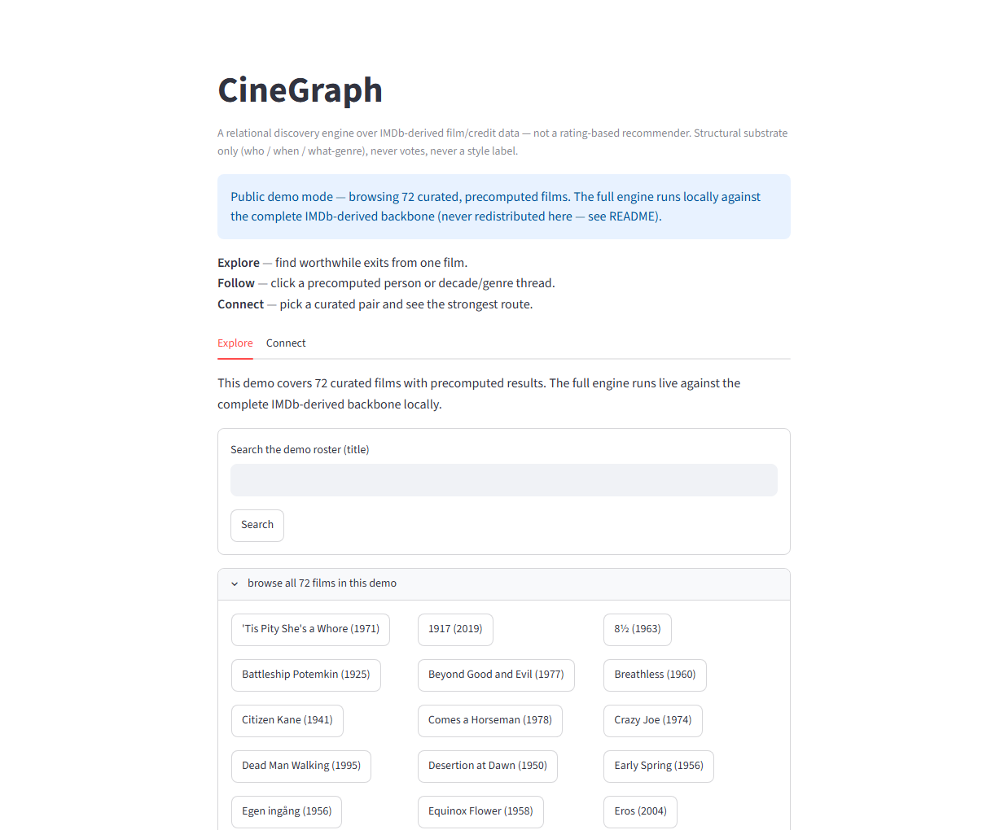
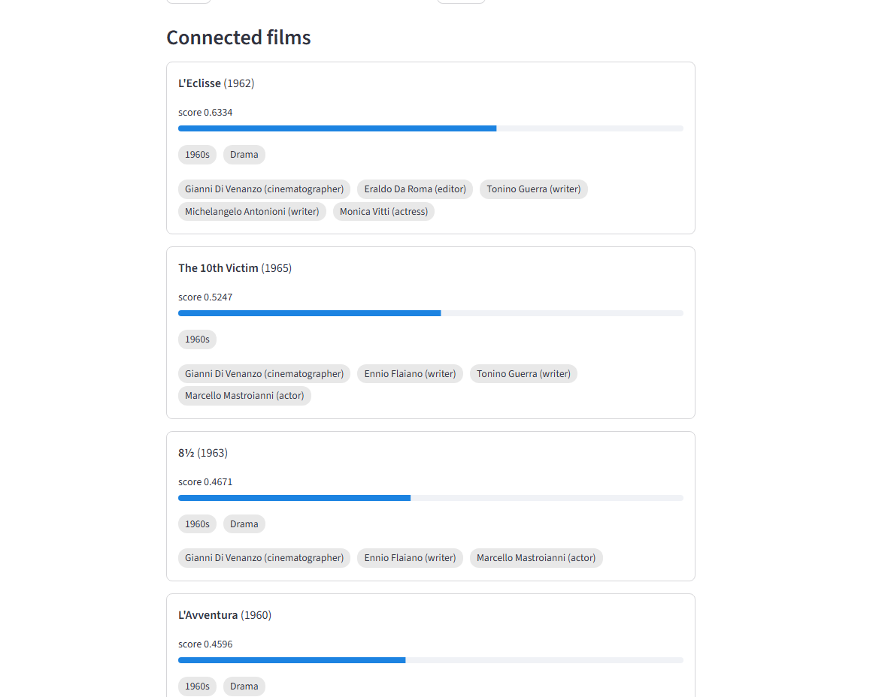
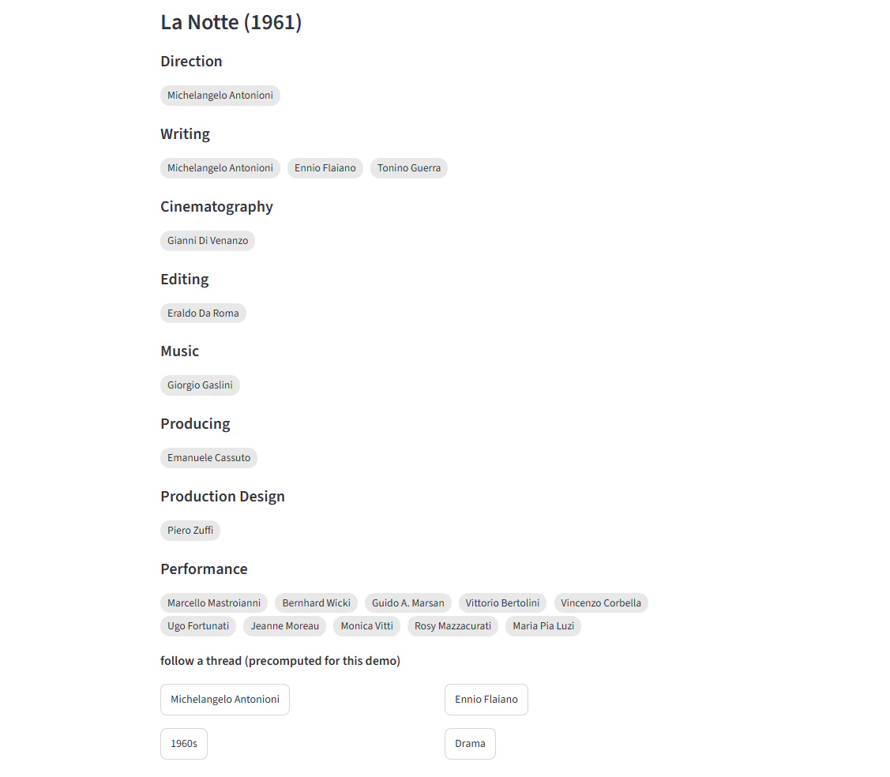
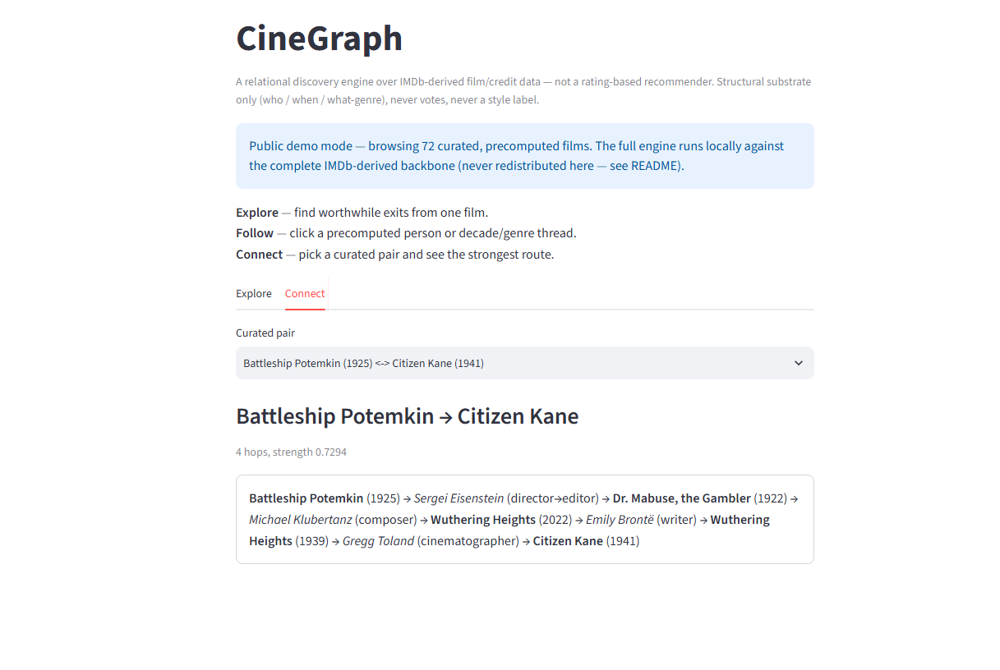
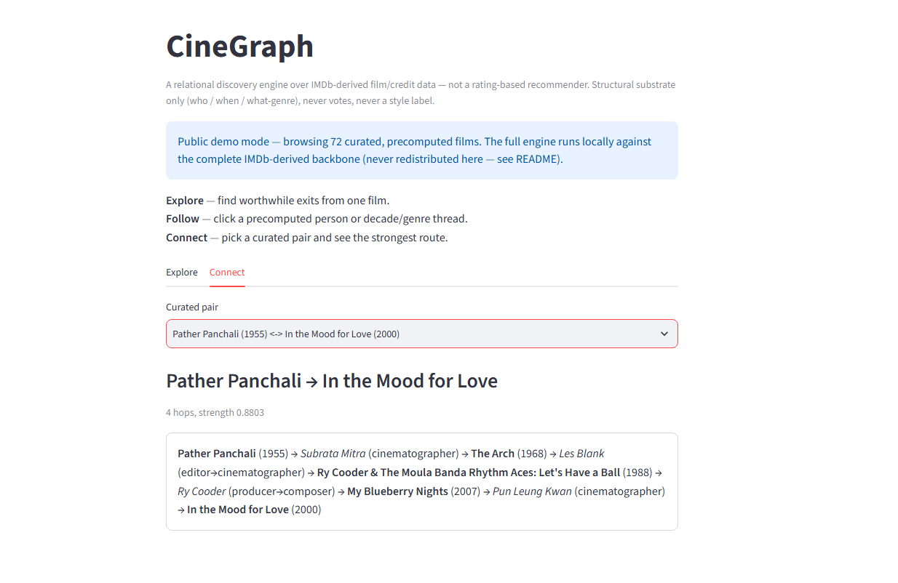
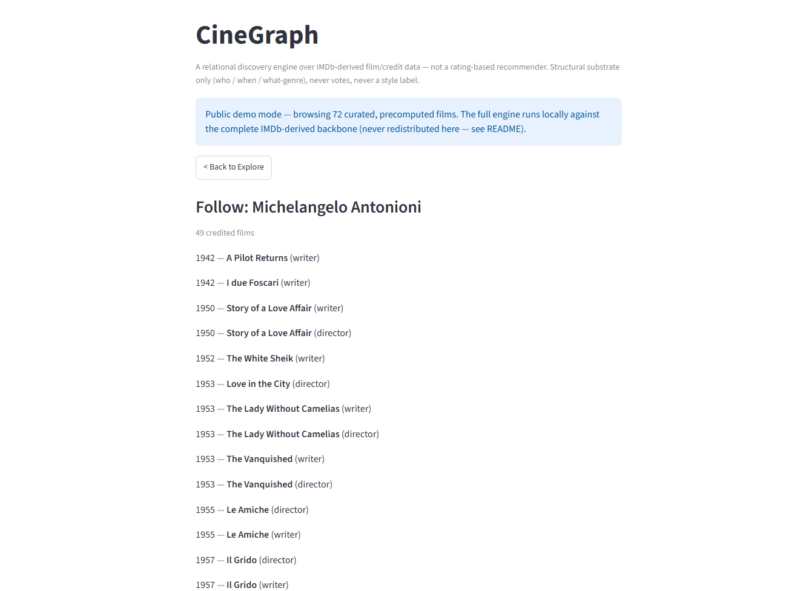
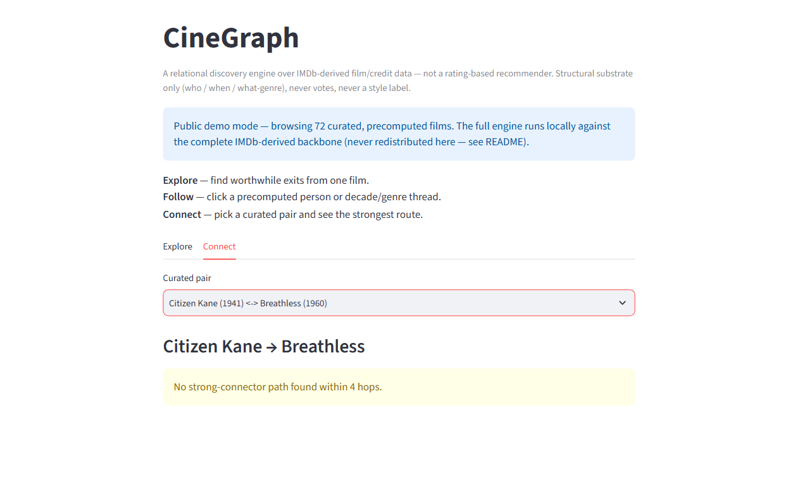

# CineGraph

A relational discovery engine for navigating film history. It answers two questions I actually care about as a film viewer: **where can this film take me?** and **how are these two films connected?**

CineGraph works from structural information in the production graph — who worked on what, when a film was made, and basic genre context. It does not rank by audience ratings or try to assign a style label. Every result shows the connection that produced it, because the path is the explanation.

I deliberately keep audience votes out of ranking. Popularity tends to pull discovery back toward already-visible films, which is the opposite of what I wanted from this project. CineGraph instead gives more weight to specific collaborator relationships than to people connected to hundreds of titles.

**Live demo:** [https://cinegraph.streamlit.app](https://cinegraph.streamlit.app)  
The public demo contains 72 curated, precomputed films. The full engine runs locally against the much larger IMDb-derived backbone.



---

## Why I built it

I usually discover films by following people and production histories rather than by asking for titles that are simply "similar." A cinematographer leads into another director's work; an editor opens a different filmography; a writer turns up somewhere unexpected.

Most recommender projects I came across were built around ratings or user-item interactions. I wanted to see how far a discovery system could get from the production graph alone.

---

## What it does

### Explore — worthwhile exits from one film

Seed a film and CineGraph returns films connected through its production graph, ranked by how specific the relationship is.

A collaborator with a small, specific filmography carries more weight than a very common cast connection. Seeding *La Notte* surfaces *L'Eclisse*, *8½*, and *L'Avventura*, largely through Gianni Di Venanzo's cinematography and the Guerra/Flaiano writing network. The cluster comes out of production relationships rather than ratings.



### Craft-first film view

Credits are organized by craft department rather than shown as one flat cast-and-crew list.

That matters because cinematographers, editors, composers, writers, and other below-the-line collaborators often carry the strongest discovery signal in this graph.



### Follow — pursue a thread

Follow a person, decade, or genre and continue through that thread.

Following a cinematographer, for example, opens their connected filmography with the role shown for each film. The same interaction works for writers, editors, composers, directors, performers, and the context entities available in v1.



### Connect — the strongest route between two films

Connect looks for the strongest **meaningful** route between two films, not merely the shortest path.

A path exists between almost any two films if shared decade or genre are allowed to bridge them. That produces database trivia rather than useful discovery. CineGraph therefore allows only strong collaborator edges to form Connect hops; decade and genre can provide context, but cannot manufacture a route.

When no strong route exists within the hop limit, the engine says so.



---

## Evaluation

I did not want to tune the ranking by repeatedly looking at outputs until they felt right.

The result tables were committed before the human labeling pass, so I could not quietly change recommendations after seeing which ones looked bad.

I evaluated **120 results across 12 seed films**, labeling each result:

- `interesting`
- `trivial`
- `wrong`

Every weak result was then separated into:

- `data-limited` — the graph did not contain a strong enough representation of the film
- `weighting-limited` — the graph contained useful relationships, but the ranker emphasized the wrong ones

The baseline produced **60/120 interesting results**. After tuning, **72/120 were interesting and 8/120 were wrong**.

These are **development-set results, not an unbiased final benchmark**: the same 12 seeds were used to diagnose and tune the model.

The labels exposed two very different problems.

*Breathless* was primarily a data problem. Its available principal-credit neighborhood was dominated by cast connections, so the engine had little production structure to work with.

*Tokyo Story*, *8½*, and *Pather Panchali* were mainly ranking problems. Their data was meaningful, but dense recurring crew networks kept collapsing the results back into one filmmaker's orbit.

Two changes came directly from that evaluation:

1. **Same-director penalty** — demote, not purge. Same-director results can still be useful, but they should not occupy most of the list simply because an auteur reused the same crew.
2. **Temporal plausibility gate** — remove impossible credit edges, such as a person being credited before their birth year, while keeping legitimate posthumous source-material writing relationships.

One idea did not survive the evaluation: using year distance as a proxy for discovery quality. I dropped it rather than tuning around it.

---

## Limitations

These are not hidden edge cases. They came directly out of testing the system.

### Wandering strongest-path

A structurally valid path is not automatically a good cinephile connection.

Without a separate attention or curation signal, Connect can route through forgettable films that happen to share specific crew — or through technically real but historically misleading credits.

This deployed example connects *Battleship Potemkin* to *Citizen Kane* partly through a modern rescore credit attached to a 2022 *Wuthering Heights*. Every hop exists in the graph, but the middle is not a connection a cinephile would naturally draw.



### Auteur / crew-clique collapse

When a director repeatedly works with the same cinematographer, editor, composer, and writers, "rare shared collaborator" and "another film by the same director" start becoming the same signal.

That is why films by Ozu, Fellini, and Ray can still crowd an Explore list even after a same-director penalty.

This is a list-level diversity problem, not another scalar-weight problem. A later version should use route-aware reranking such as MMR/xQuAD-style diversification.

### Coverage skew

The graph is only as connected as the credit data available to it.

Older, non-Western, independent, and less-documented films can have much thinner production metadata. *Breathless* was the cleanest example in the evaluation: the available principal rows were dominated by cast, so CineGraph could not recover the sort of craft network I wanted from the seed.

The UI flags thin-data cases rather than presenting cast-heavy noise as confident discovery.

### No path is better than a meaningless path

Connect does not guarantee an answer. If no strong collaborator route exists within the allowed hop count, it returns an honest no-path state instead of falling back to decade or genre.



The broader limitation behind all of these is simple: **structural rarity is not the same thing as cinematic importance**.

---

## Architecture

```text
IMDb non-commercial datasets
        ↓
canonical films + credits (DuckDB)
        ↓
weighted relational graph
(inverse-frequency edge weights)
        ↓
Explore / Follow / Connect
        ↓
FastAPI + Streamlit
```

Current local backbone:

- **744,866 films**
- **2.9M title-variant lookup rows**
- credit graph spanning **2.2M people**
- pandas-free engine
- DuckDB-backed local data layer
- pre-registered evaluation harness
- unit tests in CI, with integration tests kept separate
- reconciliation counts asserted rather than treating a successful pipeline run as sufficient

The public demo is intentionally smaller because the underlying IMDb datasets are not redistributed.

---

## Data and licensing

Code is released under the MIT License.

IMDb's non-commercial datasets are used locally under IMDb's applicable personal/non-commercial terms and are **not redistributed**. The public Streamlit demo contains a small set of precomputed outputs rather than the underlying IMDb credit tables.

This is a non-commercial portfolio project.

See [`DATA_SOURCES.md`](DATA_SOURCES.md) for the data-source and licensing boundaries.

---

## Run locally

The public demo is precomputed. The full local engine expects the IMDb-derived data artifacts that are intentionally excluded from the repository.

See the project setup instructions and `DATA_SOURCES.md` before running the full local version.

---

## Status

The first public version is intentionally narrow:

- Explore
- craft-first film view
- Follow
- Connect
- explicit evaluation
- honest failure states

The next work is not another round of scalar tuning. The main open problems are list-level diversity, richer role integrity, and better attention/curation signals for paths that are structurally valid but cinematically weak.
